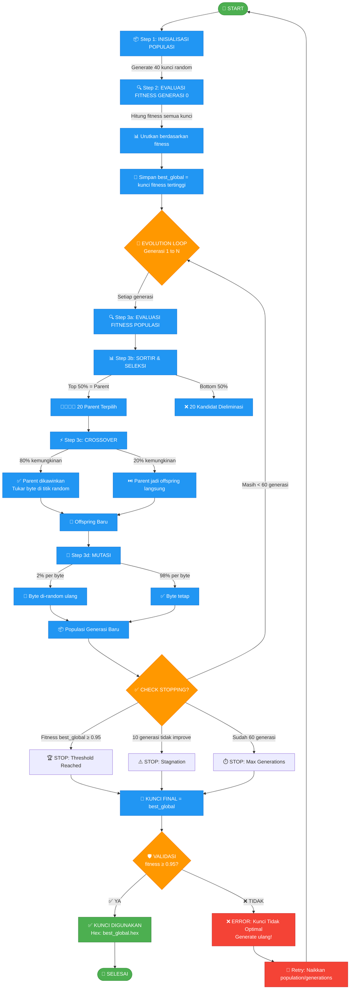

# 🧬 Alur Generate Kunci AES menggunakan Genetic Algorithm (GA)



---

## 📋 Penjelasan Detail Setiap Tahap

### **1️⃣ INISIALISASI POPULASI (Generasi 0)**
```
🎲 Membangkitkan 40 kunci acak (16 byte random masing-masing)
   Contoh:
   Key-1 : A3 7F 2B ... 
   Key-2 : 1C 9D 4E ...
   ...
   Key-40: 8B 02 F1 ...
```

### **2️⃣ EVALUASI FITNESS GENERASI 0**
```
📊 Setiap kunci dihitung fitness-nya (0-1):
   Fitness = (0.6 × Shannon Entropy) + (0.4 × Bit Balance)
   
   Hasil sorting:
   Rank 1  → Key-23 → fitness: 0.72  ← best_global awal
   Rank 2  → Key-7  → fitness: 0.68
   ...
   Rank 40 → Key-15 → fitness: 0.31
```

### **3️⃣ EVOLUTION LOOP (Generasi 1-60)**

#### **3a. EVALUASI FITNESS**
```
🔍 Hitung fitness untuk semua 40 kunci di populasi saat ini
```

#### **3b. SELEKSI (Elitisme)**
```
👨‍👩‍👧‍👦 Top 50% (20 terbaik) → jadi PARENT
❌ Bottom 50% (20 terburuk) → ELIMINASI

Parent terpilih:
  P1: fitness 0.85
  P2: fitness 0.82
  ...
  P20: fitness 0.65
```

#### **3c. CROSSOVER**
```
⚡ Parent dikawinkan secara random:
   80% → Crossover (tukar byte di titik random)
   20% → Langsung jadi offspring

   Contoh Crossover:
   Parent-1 : A3 7F 2B 9C | 4E 1D 8A 5F
   Parent-2 : 1C 9D 4E 2A | 7B 3C 6F 0E
              ─────────────┼────────────
              Titik Crossover di byte ke-4
              ─────────────┼────────────
   Child-1  : A3 7F 2B 9C | 7B 3C 6F 0E  ← Gabungan
   Child-2  : 1C 9D 4E 2A | 4E 1D 8A 5F  ← Gabungan
```

#### **3d. MUTASI**
```
🎲 Setiap byte punya 2% kemungkinan di-random ulang:

   Sebelum Mutasi:
   Child-1: A3 7F 2B 9C 7B 3C 6F 0E ...
   
   Mutasi terjadi di byte ke-3 dan ke-7:
   Child-1: A3 7F [D4] 9C 7B 3C [A1] 0E ...
                    ↑           ↑
                 Byte baru   Byte baru
   
   Sesudah Mutasi → jadi anggota populasi baru
```

### **4️⃣ TRACKING BEST GLOBAL**
```
💾 Sistem selalu ingat kunci dengan fitness TERTINGGI sepanjang evolusi:

   Generasi 1 → best: 0.78
   Generasi 2 → best: 0.82  ← update!
   Generasi 3 → best: 0.82  ← tidak improve
   Generasi 4 → best: 0.89  ← update!
   Generasi 5 → best: 0.89  ← tidak improve
   ...
   Generasi N → best: 0.96  ← update! ✅ ≥ 0.95 → STOP!
```

### **5️⃣ STOPPING CONDITION**
```
Berhenti kalau SALAH SATU:
✅ Threshold Reached → fitness best_global ≥ 0.95
⚠️ Stagnation → 10 generasi berturut-turut tidak improve
⏱️ Max Generations → sudah 60 generasi
```

### **6️⃣ VALIDASI FINAL**
```
🛡️ Cek akhir:
   IF fitness(best_global) ≥ 0.95:
      ✅ KUNCI VALID → Return hex key
   ELSE:
      ❌ KUNCI TIDAK OPTIMAL → Raise Error → Generate ulang!
```

### **7️⃣ KUNCI FINAL**
```
🔑 Contoh kunci yang berhasil di-generate:
   
   Hex: 4A 7F 2E 9B 1C 8D 3F 6A 5E 0B 7C 4D 9A 2F 8E 1B
   
   Fitness: 0.96
   Entropy: 3.85/4.00 (96.3%)
   Bit Balance: 0.94
   
   ✅ Kunci siap digunakan untuk enkripsi AES-128
```

---

## 🎯 Analogi Sederhana

> **Bayangkan evolusi kunci seperti breeding ikan hias:**
> 
> 1. **Inisialisasi** → Beli 40 ikan random dari pasar
> 2. **Evaluasi** → Nilai keindahan setiap ikan (0-1)
> 3. **Seleksi** → Pilih 20 ikan terindah jadi induk
> 4. **Crossover** → Kawinkan induk untuk dapat anak
> 5. **Mutasi** → Kadang anak punya sifat random yang berbeda
> 6. **Generasi baru** → Anak jadi populasi baru, ulangi proses
> 7. **Stop** → Ketemu ikan dengan keindahan ≥ 0.95
> 
> **Ikan terindah sepanjang breeding = KUNCI FINAL** 🐟✨

---

## 📊 Ringkasan Parameter Default

| Parameter | Nilai | Fungsi |
|---|---|---|
| `population` | 40 | Jumlah kunci per generasi |
| `generations` | 60 | Maksimal generasi evolusi |
| `crossover_rate` | 0.8 (80%) | Kemungkinan parent di-crossover |
| `mutation_rate` | 0.02 (2%) | Kemungkinan tiap byte termutasi |
| `fitness_threshold` | 0.95 | Minimal fitness agar kunci valid |
| `stagnation_limit` | 10 | Generasi tanpa improvement sebelum stop |

---

## 🔍 Fitness Function Detail

```python
Fitness = (0.6 × Entropy) + (0.4 × Bit Balance)

📊 Shannon Entropy (60%):
   - Mengukur diversitas byte dalam kunci
   - Max untuk 16 byte = log2(16) = 4.0
   - Normalisasi: entropy_actual / 4.0
   - Contoh: 3.85/4.0 = 0.963

🔢 Bit Balance (40%):
   - Mengukur keseimbangan bit 0 dan 1
   - Ideal: 50% bit 0, 50% bit 1
   - Skor 1.0 jika perfect 50/50
   - Contoh: 0.94 (47% bit 0, 53% bit 1)

Contoh Perhitungan:
   Key: 4A 7F 2E 9B 1C 8D 3F 6A 5E 0B 7C 4D 9A 2F 8E 1B
   
   Entropy = 3.85 → Normalized = 3.85/4.0 = 0.963
   Bit Balance = 0.94
   
   Fitness = (0.6 × 0.963) + (0.4 × 0.94)
           = 0.578 + 0.376
           = 0.954 ✅ ≥ 0.95 → VALID!
```

---

*Dibuat untuk presentasi skripsi/tugas akhir - Sistem Enkripsi AES dengan Optimization Key menggunakan Genetic Algorithm*
